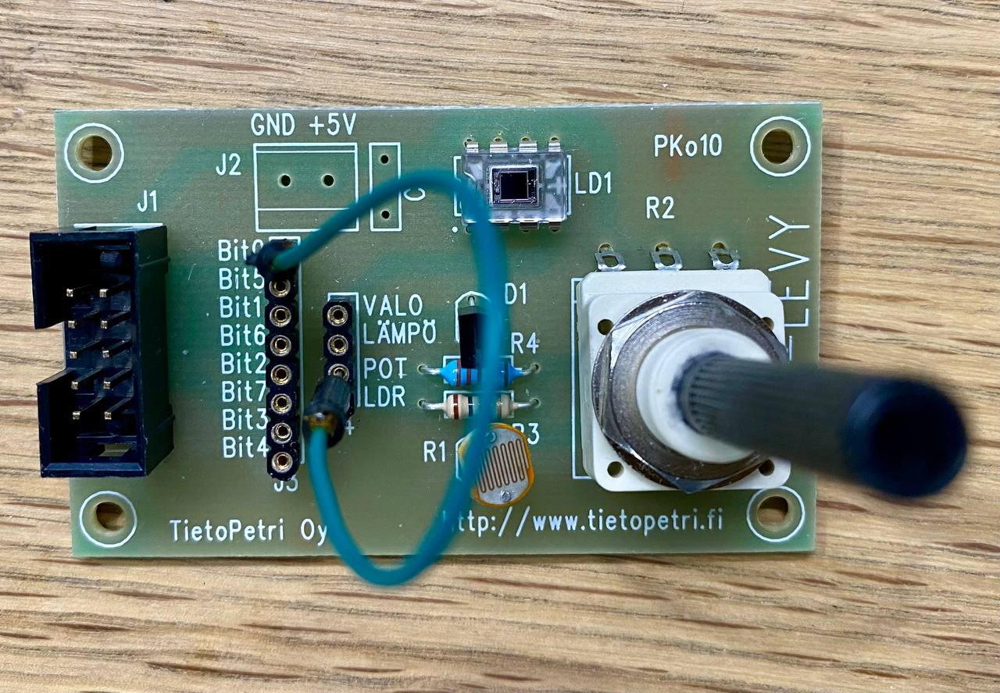
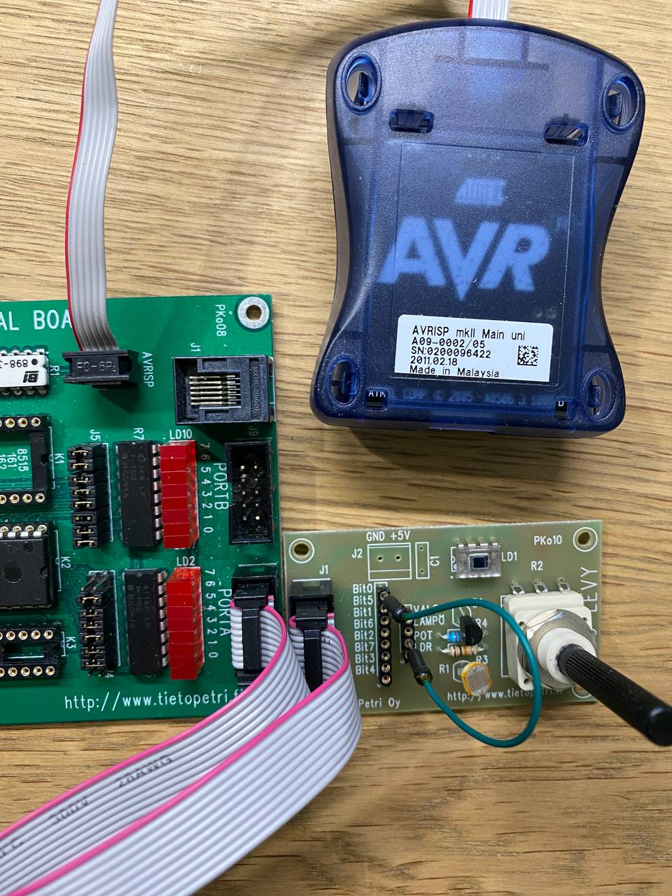
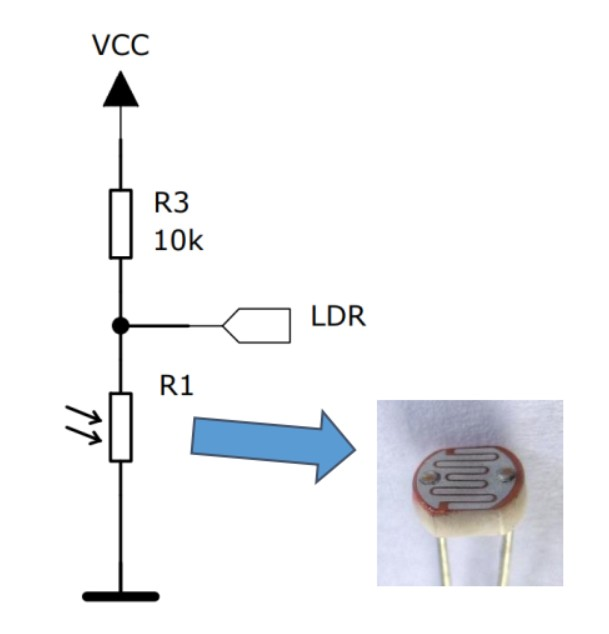
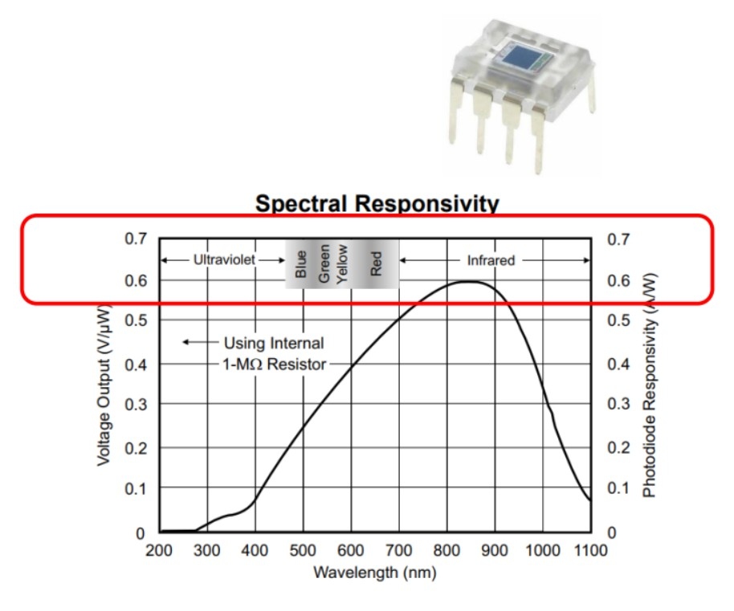

# Analog-Digital Conversion

## Instruction

ATmega32 ADC

- 10-bit resolution (𝑛 = 10)
- Successive Approximation ADC
- 8 multiplexed single ended input channels (Port A).
- Up to 15kSPS (kilo Samples Per Second) at maximum resolution.
- Registers related to ADC: ADCH, ADCL, ADCSRA, ADMUX
  ADC works at a clock rate which is between 50kHz to 200kHz, so the CPU clock (8Mhz) has to be down-scaled to this range (ADC prescaler is set in ADCSRA). Thus, our F_CPU=8MHz, 8000000Hz/64 = 125kHz is a good clock rate for ADC, we need to set ADCSRA = 10000110 (86H).

## Interfacing Analog Device

Note: take away the jumper of PAx if connect ADC device to pin PAx

- Photoresistor: The resistance may change from MΩ to a few hundreds Ω, so in the following circuits, the LDR voltage may vary between Vcc to 0.2V, depending on the intensity of light.
  

- Monolithic Photodiode: OPT101 is packaged as a module with 8 pins has good sensitivity of infrared.
  

## Tasks

- Task 1: Design a program which monitors ADC1 voltage, if the voltage is below Vref/2, all the LEDs on port D will be off; if the voltage is over Vref/2, all the LEDs of port D will be turned on.
- Task 2: Continue from task 1, add another function: the program counts how many times the value is over Vref/2 and displays this count value on port B as binary value from 00H.
- Task 3: Use ADMUX to select both Channel 0 and 1 from port A as analog input. And use the potentiometer and photoresistor to get 2 variable voltages between 0 and 5V. The program keeps monitoring the voltages of these 2 inputs, if channel 1 is higher than 2, turn on Port B upper 4 LEDs, if not, turn on Port B lower 4 LEDs.
- Task 4: Use ADMUX to select Ch0 and Ch1 from potentiometer and photoresistor. Use Port D as button input, and Port B as LED output. If button PD0 is pressed, make an AD conversion on Ch0; if button PD1 is pressed, make an AD conversion on Ch1; If current conversion of Chx is changed over ±0.1Vcc from the previous value, toggles LEDs of Port B. (Ch0 for 0,2,4,6, Ch1 for 1,3,5,7)
- Task 5: use ADC7 as analog input, and PortD as digital input to switch board, PortB as LED output. If PD0 is pressed, take a conversion, if the analog voltage is below 1V, all LEDs off, if it's 1-2V, the rightmost 2 LEDs on, if i'ts 2-3V, the rightmost 4 LEDs on, if it's 3-4V 6 LEDs on, if 4-5V, all LEDs are on.
- Task 6: connect ADC board to PORTA, and connect LDR to PA0. Make a program which turns on PORTB LEDs if the photoresistor is covered. Display how many times the photoresistor is covered on PORTC.
- Task 7: connect ADC board to PORTA, and connect OPT101 to PA0. Make a program which shows how many times OPT101 is covered by a black plastic piece on PORTB, and how many times it is covered by a human finger on PORTC.
