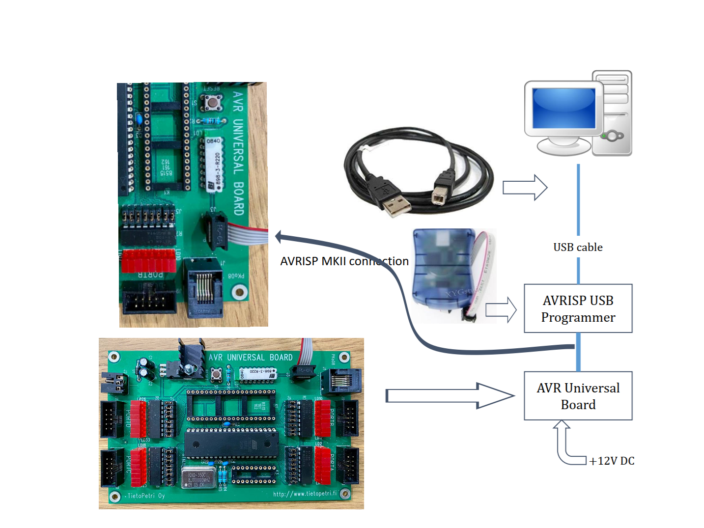
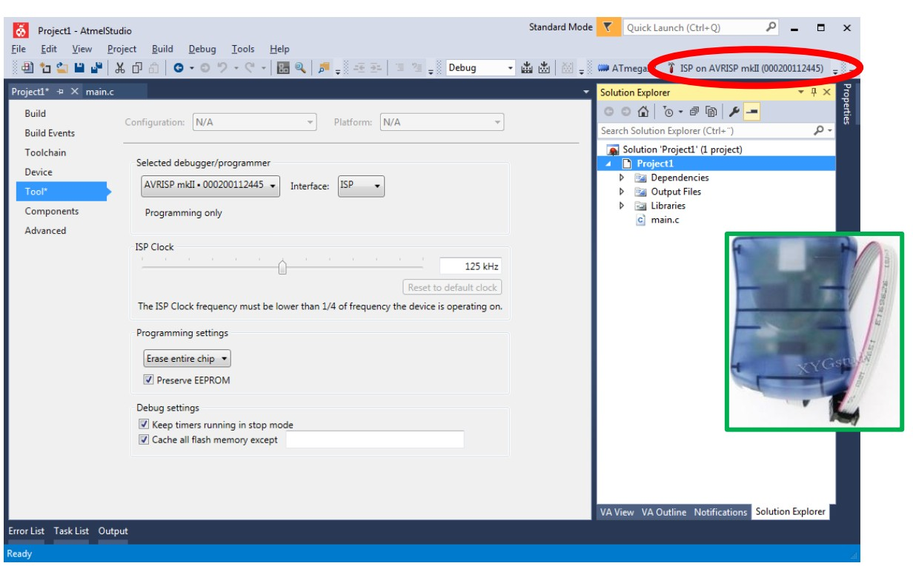
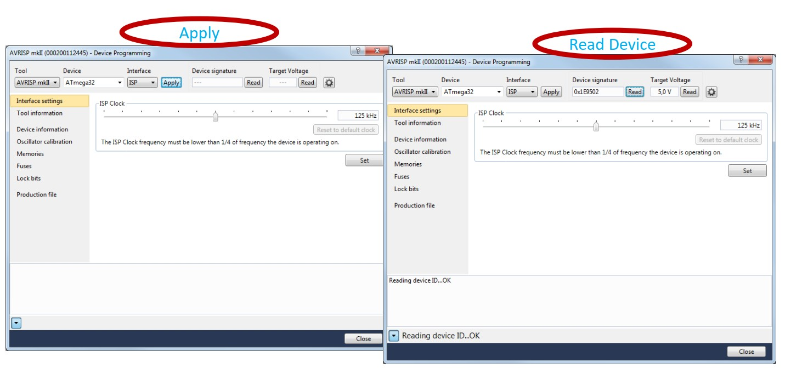
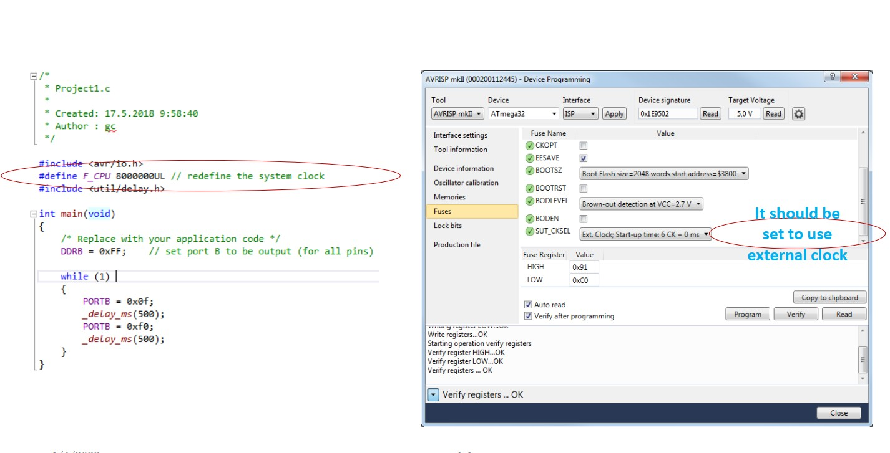

# ATMEGA32 MICROCONTROLLER
## Introduction

This repository is for learning process of programming for microcontroller Atmega32.

## List of Components  
• 1 x AVR Universal Board  
• 1 x AVRISP USB Programmer  
• 1 x USB Cable  
• 1 x DC Power Cord

## Configuration

### Programmer
A programmer transfers the executable code from PC to the
microcontroller. Several different programmers are available for Atmega. We use **AVRISP mkII**.

### Setting device
Menu -> Tools -> Device Programming

## Documentation
[Introduction to Embedded Systems](./assets/EmbeddedSystemProgrammingATmega328.pdf)

## Datasheet
[Atmega32 Datasheet](./assets/atmega32.pdf)